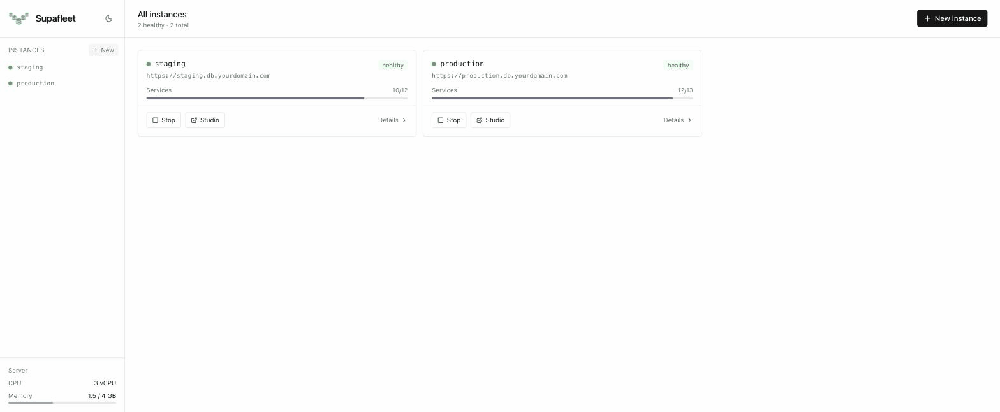

<div align="center">
  
  <h1>Supafleet</h1>
  <p>Self-hosted Supabase fleet manager. One command to spin up isolated, production-ready Supabase instances on any VPS.</p>
  <p>
    
    
    
    <br />
    <a href="https://supafleet.camc8.com"><strong>→ supafleet.camc8.com</strong></a>
    &nbsp;&nbsp;
    <a href="https://supafleet.camc8.com/demo">Interactive dashboard demo</a>
  </p>
</div>

<div align="center">
  
</div>

---

## What is Supafleet?

Supafleet lets you manage multiple self-hosted [Supabase](https://supabase.com) instances from a single dashboard on your own VPS. Each instance gets:

- A dedicated subdomain: `{name}.db.yourdomain.com`
- Supabase Studio at `{name}.db.yourdomain.com/studio`
- Its own isolated Postgres database, Auth, Storage, Realtime, and Kong API gateway
- One-click stop/start/disable for optional services to save RAM

## Features

- **Multi-instance dashboard** — create, monitor, and manage any number of Supabase instances
- **Automatic subdomain routing** — wildcard DNS + nginx, no manual DNS per instance
- **Auth-gated Studio access** — login wall in front of every Studio via JWT session
- **Service management** — stop optional services (analytics, imgproxy, vector) to reclaim memory; disable to survive reboots
- **Real-time logs** — live log streaming per service
- **Resource metrics** — CPU, memory, and network charts per instance
- **One-command setup** — `setup.sh` handles TLS, nginx, systemd, and builds

## Architecture

```
               Internet
                  |
              nginx (443)
         ┌────────┴────────┐
  *.db.domain.com     manage.domain.com
         |                  |
   auth check          Supafleet UI
    (port 4000)        (port 3001 API)
         |
  ┌──────┴──────┐
  /studio       /
     |           |
  Studio      Kong API
 (per inst)  (per inst)
```

Each Supabase instance runs as a Docker Compose project with ~10 containers isolated per project directory.

## Server Recommendations

Supafleet runs well on any Linux VPS. [Hetzner](https://www.hetzner.com/cloud/) offers the best value — fast European/US hardware at low flat-rate prices with no egress fees.

| Instances | Size | RAM | vCPU | Est. monthly (USD) | Link |
|-----------|------|-----|------|--------------------|------|
| 1–2 | CX22 | 4 GB | 2 | ~–6 | [hetzner.com/cloud](https://www.hetzner.com/cloud/) |
| 3–5 | CX32 | 8 GB | 4 | ~–11 | [hetzner.com/cloud](https://www.hetzner.com/cloud/) |
| 6–10 | CX42 | 16 GB | 8 | ~–22 | [hetzner.com/cloud](https://www.hetzner.com/cloud/) |
| 10+ | CX52 | 32 GB | 16 | ~–44 | [hetzner.com/cloud](https://www.hetzner.com/cloud/) |

> USD estimates at ~1.09 USD/EUR. Check [hetzner.com/cloud](https://www.hetzner.com/cloud/) for current pricing — Hetzner bills in EUR.

Each Supabase instance uses ~300–500 MB RAM at idle. Disabling optional services (analytics, imgproxy, vector) drops this to ~150 MB.

## Why Hetzner?

- **~–6/mo** for a capable 2 vCPU / 4 GB VPS (CX22) — a fraction of AWS/GCP equivalent
- **No egress fees** — 1 Gbps network included, traffic doesn't add up like AWS
- **EU and US datacenters** — Ashburn (VA), Hillsboro (OR), Nuremberg, Falkenstein, Helsinki
- **Predictable pricing** — flat monthly rate, no surprise bills
- **–22 free credit** for new accounts — enough to run Supafleet for several months
- [Hetzner Cloud API](https://docs.hetzner.cloud/) for automation and provisioning

## Custom Domain Setup

Supafleet needs two domains pointing at your VPS:

| Domain | Purpose |
|--------|---------|
| `manage.yourdomain.com` | Dashboard UI |
| `*.db.yourdomain.com` | Per-instance API + Studio (wildcard) |

Each new instance automatically gets `{name}.db.yourdomain.com` — no manual DNS step needed per instance.

### Step 1 — Point DNS at your VPS

In your DNS provider, add these records (replace `203.0.113.1` with your server IP):

| Type | Name | Value | Notes |
|------|------|-------|-------|
| A | `manage` | `203.0.113.1` | Dashboard domain |
| A | `*.db` | `203.0.113.1` | Wildcard for all instances |
| A | `db` | `203.0.113.1` | Apex (optional, for the root) |

> **Cloudflare users:** Set **Proxy status → DNS only** (grey cloud) on all three records.
> TLS termination happens on the server via Let's Encrypt — Cloudflare proxying breaks the cert challenge.

### Step 2 — Get a Cloudflare API token (for wildcard TLS)

Wildcard certificates (`*.db.yourdomain.com`) require a DNS-01 ACME challenge — certbot must be able to create a TXT record in your zone. Cloudflare is the easiest way to automate this.

1. Go to [Cloudflare Dashboard](https://dash.cloudflare.com/profile/api-tokens) → **API Tokens → Create Token**
2. Use the **Edit zone DNS** template
3. Under **Zone Resources** → select your domain
4. Click **Continue to summary → Create Token**
5. Copy the token — you'll only see it once

Then save it on your server:

```bash
cat > ~/.cloudflare.ini << 'EOF'
dns_cloudflare_api_token = YOUR_TOKEN_HERE
EOF
chmod 600 ~/.cloudflare.ini
```

### Other DNS providers

Any provider that supports wildcard  records works. The  uses  for the DNS-01 challenge. For other providers (Route53, Namecheap, Porkbun, etc.), install the matching certbot plugin:

| Provider | Plugin |
|----------|--------|
| AWS Route 53 | `python3-certbot-dns-route53` |
| DigitalOcean | `python3-certbot-dns-digitalocean` |
| Namecheap | `certbot-dns-namecheap` |
| Porkbun | `certbot-dns-porkbun` |

Then pass `--dns-<provider>` instead of `--dns-cloudflare` in `setup.sh`.

## Prerequisites

- Ubuntu 22.04 or 24.04
- Docker Engine + Docker Compose v2
- Node.js 18+
- nginx
- certbot + certbot-dns-cloudflare (for wildcard TLS)
- A domain with DNS managed by Cloudflare
- A Cloudflare API token with `Zone:DNS:Edit` permission

```bash
# Install deps on Ubuntu 24.04
apt-get update && apt-get install -y git nginx certbot python3-certbot-dns-cloudflare
curl -fsSL https://get.docker.com | sh
curl -fsSL https://deb.nodesource.com/setup_20.x | bash - && apt-get install -y nodejs

# Create Cloudflare credentials file
cat > ~/.cloudflare.ini << '"'"'CF'"'"'
dns_cloudflare_api_token = YOUR_TOKEN_HERE
CF
chmod 600 ~/.cloudflare.ini
```

## Quick Start

```bash
curl -fsSL https://raw.githubusercontent.com/camc8/supafleet/main/setup.sh | bash
```

The script will prompt for:
- **Base domain** for instances (e.g. `db.yourdomain.com`)
- **Dashboard domain** (e.g. `manage.yourdomain.com`)
- **Admin email** for TLS certificate
- **Dashboard password**

Then it handles TLS, nginx, build, and systemd automatically.

## Configuration

After setup, configuration files live at:

| File | Purpose |
|------|---------|
| `/opt/supafleet/dashboard/backend/.env` | Backend config (domain, paths, CORS) |
| `/opt/supafleet/dashboard/frontend/.env.production` | Frontend config (base domain, API URL) |

To rebuild after config changes:
```bash
cd /opt/supafleet/dashboard/frontend && npm run build
systemctl restart supafleet
```

## Creating Your First Instance

1. Navigate to `https://manage.yourdomain.com`
2. Click **New Instance**
3. Enter a name (lowercase letters, numbers, hyphens)
4. Supafleet provisions the instance and configures nginx automatically
5. Access Studio at `https://{name}.db.yourdomain.com/studio`
6. API endpoint: `https://{name}.db.yourdomain.com`

## Managing Services

Each instance runs optional services that can be stopped to save memory:

- **Stop** — temporarily stop a service (restarts on reboot)
- **Disable** — permanently disable (survives reboots, `docker compose up`)
- **Enable** — re-enable a disabled service

Core services (db, kong, auth, rest, pooler, realtime) cannot be disabled.

## Updating Supafleet

```bash
cd /opt/supafleet
git pull
cd dashboard/backend && npm ci && npm run build && cd ../..
cd dashboard/frontend && npm ci && npm run build && cd ../..
systemctl restart supafleet
```

## Troubleshooting

**Dashboard not loading**
```bash
systemctl status supafleet
journalctl -u supafleet -n 50
```

**Studio returning 502**
```bash
# Check that the instance is running
docker ps | grep {name}
# Check nginx
nginx -t && systemctl reload nginx
```

**Wildcard cert not working**
```bash
certbot renew --dry-run
```

## Credits

- Built on [Supabase](https://github.com/supabase/supabase) self-hosted
- Inspired by [multibase](https://github.com/multibase) — the original multi-tenant Supabase manager
- [Kong](https://github.com/Kong/kong) API gateway
- [nginx](https://nginx.org) reverse proxy
- [Let's Encrypt](https://letsencrypt.org) / [certbot](https://certbot.eff.org) for TLS

## License

MIT — Copyright (c) 2026 Cameron Clark. See [LICENSE](LICENSE).
